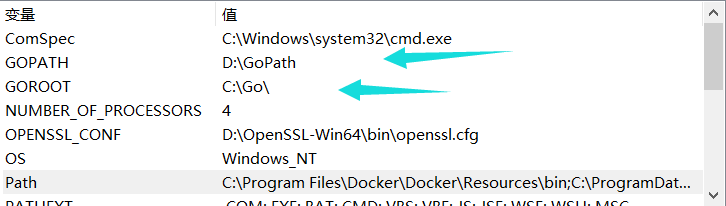
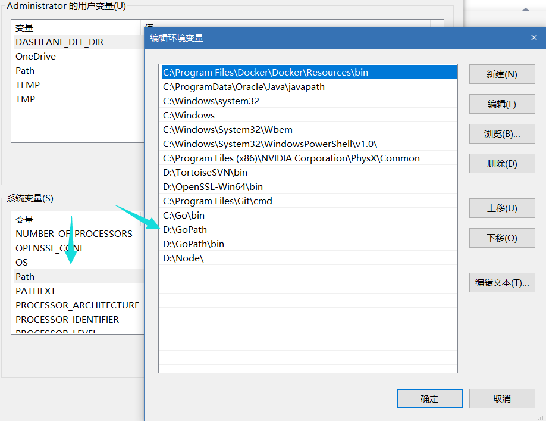
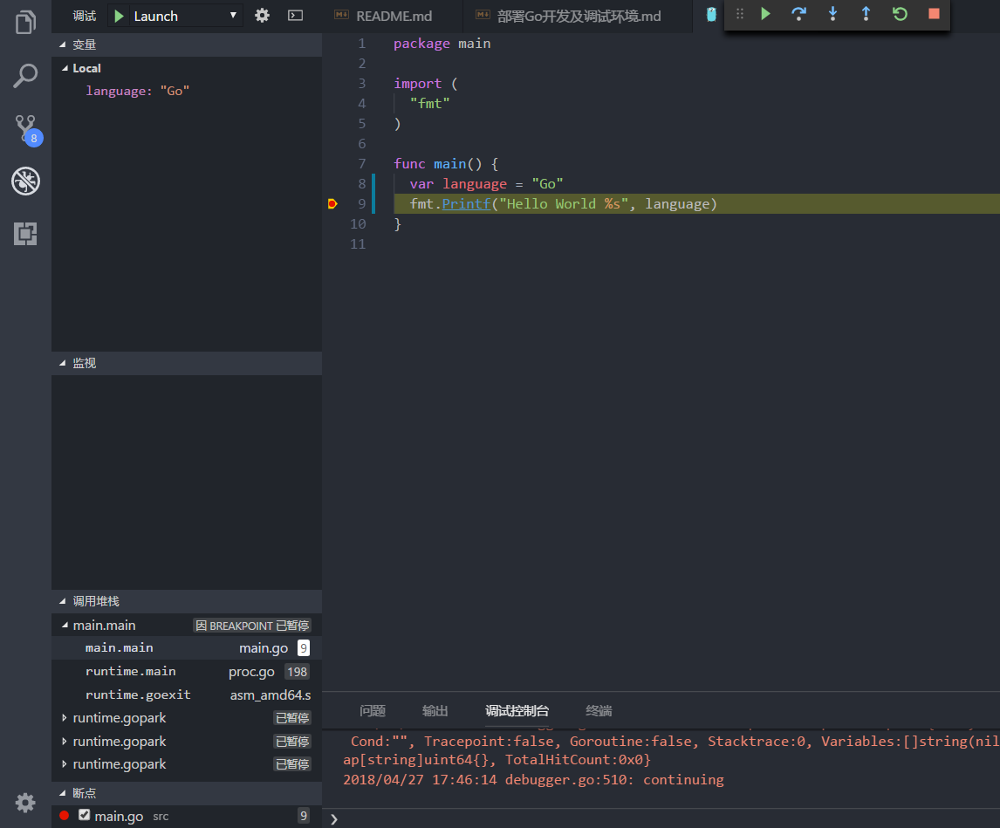

## 搭建开发环境
首先我们要安装go的包，go并不是一门需要虚拟机的语言，但是仍然需要编译环境
[GoDownload](https://golang.org/dl/)

## 配置环境变量
Go语言同样需要配置环境变量，主要有三个地方
首先配置系统的Path，配置这个地方的意义在于全局能够使用到Go命令

接着配置GOROOT GOPATH，这是编译器进行编译时寻找到的地址

## 构建debug环境
工欲善其事必先利其器，在go的编辑器选择时尝试过idea家的goland，因为是windows系统，整个IDE的界面很丑，于是还是用了熟悉的VSC。首先安装go的相关插件

这个插件安装完毕以后会提示下载相关的go包,go的包都是提供源码，然后需要在本地编译，这几个go包很蠢，编译是有依赖的，然而有的包需要的依赖包后置，导致编译失败。另外这些插件安装需要翻墙，这里提供一个windows下我编译好的源码包，如果不能使用就自行编译
[GoPath支持包](https://pan.baidu.com/s/1Vlwfln5m9J7YH2DUVkcw8g)
接着在VSC左边的debug小窗口开启调试，注意设着入口的路径

## 最后完整的代码
